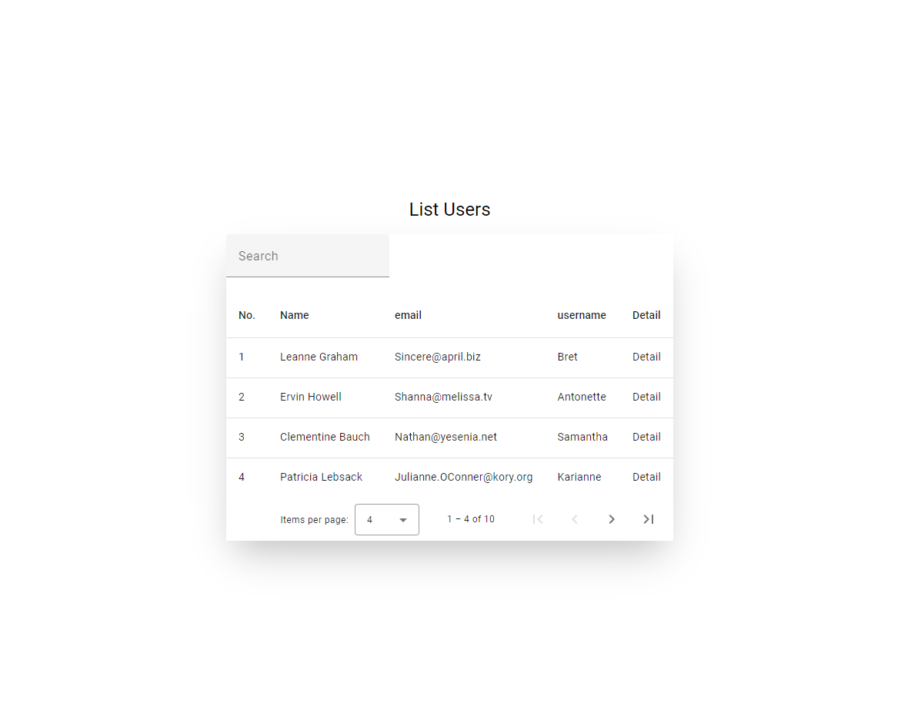
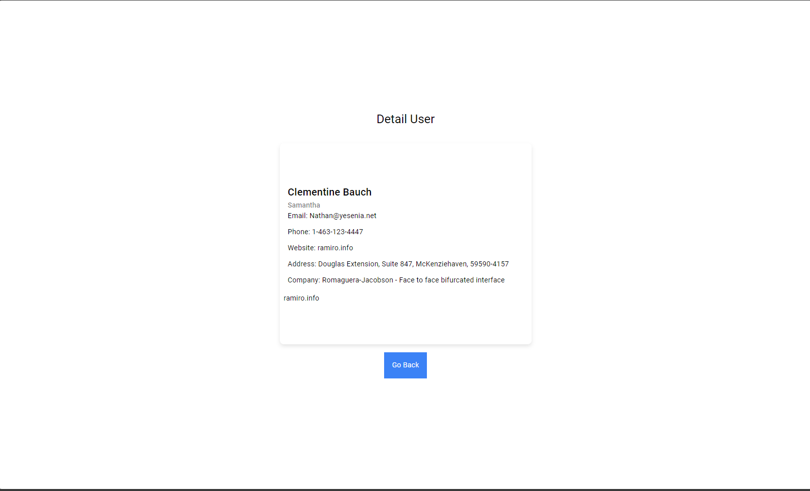

## Instalar dependencia

Ejecute `npm install`

## Levantar el proyecto correr el comando

Ejecute `ng serve` para un servidor de desarrollo. Navegue hasta `http://localhost:4200/`. La aplicación se recargará automáticamente si cambia alguno de los archivos fuente.

## Construir la app

Ejecute `ng build` para construir el proyecto. Los artefactos de compilación se almacenarán en el directorio `dist/`.

## Unit tests

Ejecute `ng test` para ejecutar las pruebas unitarias a través de [Karma]

## Screenshot

-- List Users

-- Detail user

